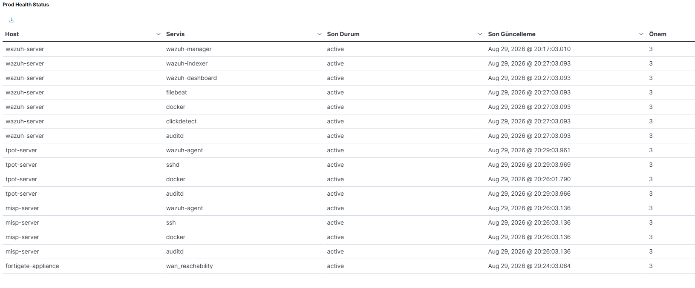
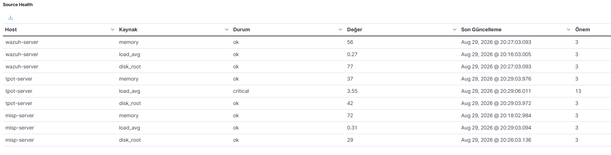
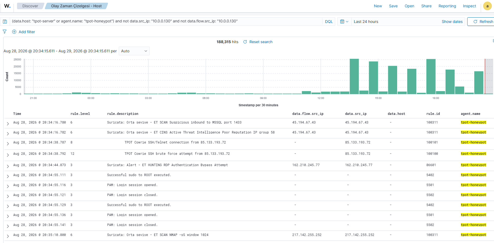

# Sıfırdan Üretim Seviyesine: SOC Homelab

**Sıfır bütçeyle (Oracle Cloud Always Free / ARM64) kurulmuş, kendi kendini izleyen, kendi kendini savunan ve gerçek saldırı verisiyle günlük olarak test edilen bir Security Operations Center mimarisi.**

Bu repo bir "nasıl kurulur" öğreticisi değil — gerçek bir üretim SOC'unun mimari kararlarının, otomasyonunun ve karşılaşılan/çözülen krizlerin kaydıdır. Tüm süreç, gerekçeleriyle birlikte iki dilli (TR/EN) bir teknik yazı dizisi olarak Medium'da yayınlanmıştır.

**[Tam yazı dizisini Medium'da okuyun →](https://medium.com/@akinfarfar/s%C4%B1f%C4%B1rdan-%C3%BCretim-seviyesine-bir-soc-analistinin-homelab-ve-operasyon-rehberi-452a73debdde)**

[](https://github.com/akinfarfar/soc-homelab/actions/workflows/secrets-scan.yml)

---

## İçindekiler

- [Mimariye Genel Bakış](#mimariye-genel-bakış)
- [Neden Bu Proje Var](#neden-bu-proje-var)
- [Dört Evre](#dört-evre)
- [Teknoloji Yığını](#teknoloji-yığını)
- [Ölçülebilir Sonuçlar](#ölçülebilir-sonuçlar)
- [Ekran Görüntüleri](#ekran-görüntüleri)
- [Repo Yapısı](#repo-yapısı)
- [Bu Projeyi Yeniden Kurmak](#bu-projeyi-yeniden-kurmak)
- [Öne Çıkan Mühendislik Kararları](#öne-çıkan-mühendislik-kararları)
- [Yazı Dizisi](#yazı-dizisi)
- [İletişim](#i̇letişim)

---

## Mimariye Genel Bakış

```
İnternet
   │
   ├── Cloudflare (WAF + Zero Trust Access) ──► Wazuh Dashboard (Proxied, MFA'lı)
   └── Cloudflare (DNS-only) ──────────────────► T-Pot Honeypot Fleet
                                                        │
   OCI VCN Security List (host firewall'dan bağımsız katman)
                                                        │
        ┌───────────────────────────────────────────────┴───────────────────┐
        │                                                                    │
   FortiGate NGFW ──(syslog)──► Wazuh SIEM ◄──(agent)── T-Pot + Suricata IDS
   (bağımsız perimeter)    (tek node, 3 bileşen:          (30+ honeypot)
                            Indexer+Manager+Dashboard)
                            + ClickDetect (Sigma/MITRE)
                                      │
                                      ├──► MISP (ayrı sunucu, kendi IoC üretimi)
                                      │
                                      └──► n8n (risk skorlama, orkestrasyon)
                                                │
                                                └──► Active Response (otomatik ban)
                                                └──► SOC Triage Dashboard
                                      │
                            Health Monitor (bağımsız nabız kontrolü) ─┐
                                      │                                │
                            Case Manager (SQLite, otomatik/manuel kapatma)
```

Detaylı topoloji diyagramı `docs/diagrams/architecture.mmd`'de (Mermaid) ve Medium serisindeki ilgili makalelerde yer alıyor.

---

## Neden Bu Proje Var

Başlangıç noktası basitti: *"Bir SOC Analyst pozisyonu için CV'ime ne koyabilirim?"* Piyasada Wazuh kurulumunu anlatan onlarca öğretici var. Bu projenin amacı farklı: bir güvenlik mimarisinin **gerçekte nasıl inşa edildiğini** — dokümantasyonda değil, gerçek bir sunucuda, gerçek hatalarla — göstermek.

Her kriz, her yanlış varsayım ve her düzeltme, gizlenmek yerine belgelendi. Bir SOC analistinin gerçek işi mükemmel bir sistem inşa etmek değil, **bir şey bozulduğunda nereye bakacağını bilmektir.**

---

## Dört Evre

### 1- Temel Mimari
Wazuh SIEM (tek node üzerinde 3 bileşen: Indexer + Manager + Dashboard — cluster modu bilinçli olarak kullanılmıyor), T-Pot honeypot ağı (30+ servis), FortiGate NGFW, Cloudflare WAF/DNS. Splunk'tan Wazuh'a mimari geçiş, FortiGate'in `auto-asic-offload` IPS bypass bug'ının paket seviyesinde teşhisi, Geo-IP engellemenin dürüst şekilde "doğrulanamadı" olarak belgelenmesi.

### 2- Kod ve Otomasyon
Ansible ile Infrastructure as Code, age+sops ve ansible-vault ile secrets şifreleme, MISP ile kendi tehdit istihbaratının üretilmesi (+ CIRCL/Botvrij.eu dış feed entegrasyonu, 630K+ attribute), Sigma kurallarının ClickDetect+Lucene DSL üzerinden platformdan bağımsızlaştırılması, n8n ile risk-bazlı otomatik triage.

### 3- Kernel Seviyesinde Araştırma
eBPF tabanlı telemetri manipülasyonu tehdit modeli, `auditd`+Wazuh ile tespit katmanı, Docker/runc'un meşru `bpf()` kullanımı bulunduğunda önlemenin risk-temelli olarak izole bir VMware sandbox'ına ertelenmesi, ve dört katmanlı bir kaynak güven skorlama modelinin tasarlanması.

### 4- Operasyonel Olgunluk
Günlük/haftalık triage disiplini, kendi kendini izleyen bir health-monitor katmanı (+ Wazuh Manager'dan tamamen bağımsız bir nabız kontrolü), log gürültüsü azaltma, MDR/EDR/XDR benzeri genişleme (Case Manager, LLM tabanlı alarm triaj, XDR zaman çizelgesi), "gözlemciyi kim izliyor?" sorusuna verilen gerçek bir cevap, ve periyodik bir güvenlik denetiminin (Aşama 1/2) kendi bulgularını bir sonraki adıma (CI'da otomatik secrets taraması) dönüştürmesi.

---

## Teknoloji Yığını

| Katman | Araçlar |
|---|---|
| SIEM / Tespit | Wazuh, Sigma Rules, ClickDetect, MITRE ATT&CK |
| Honeypot / IDS | T-Pot (Cowrie, Dionaea, Heralding, H0neytr4p), Suricata |
| Perimeter | FortiGate NGFW, Cloudflare WAF/Access, OCI Security List / NSG |
| Tehdit İstihbaratı | MISP (+ CIRCL OSINT, Botvrij.eu), AbuseIPDB, Spamhaus |
| Otomasyon / SOAR | n8n, Wazuh Active Response, Google Gemini (LLM triaj) |
| Altyapı | Ansible, Docker, age + sops, ansible-vault, GPG |
| CI / Güvenlik | GitHub Actions, gitleaks (her push'ta otomatik secrets taraması) |
| Güvenlik Araştırması | auditd, bpftool, kernel lockdown, eBPF tehdit modellemesi |
| Bulut | Oracle Cloud Infrastructure (ARM64/Always Free), Hetzner |

---

## Ölçülebilir Sonuçlar

| Metrik | Değer |
|---|---|
| MITRE ATT&CK'e eşlenen olay | 40.000+ |
| Suricata log gürültüsü azaltma | 359.000/gün → ~16 |
| Tespit edilen kampanya | 13 gün, otomasyonun %86'sını kaçırdığı bir RDP keşif kampanyası |
| T-Pot disk kullanımı iyileştirmesi | %79 → %42 (kullanılmayan ELK stack kaldırılarak) |
| MISP tehdit istihbaratı kaydı | 630.000+ attribute |
| Ansible ile kodlanan rol sayısı | 20 (idempotent, `--check --diff` ile doğrulanmış) |
| Ağ segmentasyonu | 5 NSG, 53 kural |
| Credential/IP/domain sızıntısı bulunup temizlenen | 2 API key (Faz 2) + 5 gerçek production IP + 1 domain adı (DNS üzerinden dolaylı IP sızıntısı) — `git-filter-repo` ile geçmiş temizliği + vault'a taşıma |
| CI ile otomatikleştirilen kontrol | Her push'ta gitleaks secrets taraması (bkz. rozet yukarıda) |

---

## Ekran Görüntüleri

| Prod Health Status | Kaynak Sağlığı | XDR Zaman Çizelgesi |
|---|---|---|
|  |  |  |

---

## Repo Yapısı

```
soc-homelab/
├── .github/
│   └── workflows/
│       └── secrets-scan.yml    # her push'ta gitleaks ile otomatik secrets taraması
├── ansible/
│   ├── inventory/               # host envanteri, group_vars (vault ile şifreli)
│   ├── roles/                    # hardening_ssh, hardening_ebpf, wazuh_install,
│   │                              # tpot_install, wazuh_ufw_hardening,
│   │                              # wazuh_custom_rules (+ clickdetect_examples/),
│   │                              # health_monitor, case_manager,
│   │                              # clickdetect_llm_triage, fortigate_admin_ip, ...
│   └── playbooks/
├── configs/
│   ├── systemd/                  # wazuh-manager auto-restart override
│   └── logrotate/                # health-monitor/case-manager log rotasyonu
├── dashboards/
│   └── wazuh-dashboard-panels.ndjson  # Dashboard saved objects export
├── docs/
│   ├── diagrams/                 # mimari diyagram (Mermaid)
│   ├── screenshots/               # Dashboard ekran görüntüleri
│   ├── incidents.md               # yapılandırılmış olay günlüğü (Bağlam/Semptom/
│   │                               # Teşhis/Kök neden/Çözüm/Ders şablonu)
│   └── REPRODUCIBILITY.md         # kurulum sırası, ön koşullar, notlar
├── n8n/
│   └── soc-triage-workflow.json  # risk skorlama + MISP zenginleştirme workflow'u
├── secrets/                       # age+sops ile şifrelenmiş, host-bazlı segmentli
├── LICENSE
└── README.md
```

> **Not:** `secrets/` ve `inventory/group_vars/` içeriği tamamen şifrelidir (age + sops / ansible-vault). Repo public olsa bile hiçbir gerçek credential veya IP düz metin olarak bulunmaz — git geçmişi `git-filter-repo` ile bir kez temizlenmiş, ve bu artık her push'ta gitleaks CI'ı ile **otomatik olarak** doğrulanıyor (bkz. yukarıdaki rozet).

---

## Bu Projeyi Yeniden Kurmak

Roller birbirine bağımlı, doğru sırada uygulanmaları gerekiyor. Ön koşullar, kurulum sırası ve önemli notlar (secrets yönetimi, n8n credential yeniden bağlama, hostname çakışmasından kaçınma) için: **[docs/REPRODUCIBILITY.md](docs/REPRODUCIBILITY.md)**

---

## Öne Çıkan Mühendislik Kararları

Bu proje boyunca tekrar eden tema: **hiçbir güvenlik kontrolü, kendi başına, sonsuza dek yeterli değildir.**

- **"Popüler olan doğru olan değildir"** — Splunk'ı ARM64'te zorlamak yerine Wazuh'a geçiş.
- **"Sayaç sıfırsa, özellik çalışmıyor demek değildir"** — FortiGate'in IPS'i, var olmayan bir donanımı taklit ederek trafiği sessizce atlıyordu; `diagnose debug flow` ile paket seviyesinde teşhis edildi.
- **"Bir önlemi uygulamadan önce sorgula"** — kernel lockdown'ı devreye almadan önce, Docker'ın kendi meşru `bpf()` kullanımı bulunup önleme katmanı sandbox doğrulamasına ertelendi.
- **"Yerel bir servisin sağlıklı görünmesi, gerçekte çalıştığı anlamına gelmez"** — T-Pot'un agent'ı 7 saattir Manager'a bağlı değilken yerel `systemctl status` "active" gösteriyordu.
- **"Gözlemciyi kim izliyor?"** — tüm alarm zincirinin tek dayanağı Wazuh Manager'ın kendisiydi; systemd auto-restart + tamamen bağımsız bir nabız kontrolüyle çözüldü.
- **"Bir düzeltmenin daha önce yapılmış olması, kalıcı olduğu anlamına gelmez"** — git geçmişindeki bir IP sızıntısı temizliği daha önce bir kez yapılmış ama sessizce geri gelmişti; kalıcı çözüm otomasyon (CI'da gitleaks) oldu, elle kontrol değil.

Bu kararların her birinin tam teknik dökümü (komutlar, hata mesajları, doğrulama adımları) Medium serisinde yer alıyor.

---

## Yazı Dizisi

**Faz 1 — Temel Mimari:** Splunk'tan Wazuh'a · Wazuh SIEM Kurulumu · T-Pot Honeypot (2 bölüm) · Wazuh Agent Entegrasyonu · Cloudflare & WAF · FortiGate Günlükleri (3 bölüm) · Geo-IP Engelleme · Aktif Savunma (2 bölüm) · MITRE ATT&CK Doğrulaması · Parola Rotasyonu Krizi · Domino Etkisi

**Faz 2 — Infrastructure as Code:** Secrets Management · Infrastructure as Code (2 bölüm) · MISP · Sigma Kuralları · Phase 2 Kapanışı

**eBPF Serisi:** Mevcut Durum Analizi · Production Kararı · Purple Team Deneyi · Sandbox Trust Model

**Faz 3 — Operasyonel SOC:** Bir Günün Triage'ı · Bir Haftanın Trendleri · Health Monitor & MDR/EDR/XDR

---

## İletişim

**Akın Farfar** — Junior SOC Analyst | Blue Team | Detection Engineering
Antalya, Türkiye

[LinkedIn](https://www.linkedin.com/in/akinfarfar/) · [Medium](https://medium.com/@akinfarfar) · [Credly](https://www.credly.com/users/akin-farfar/badges/credly)

---

*Bu repo ve yazı dizisi, gerçek bir öğrenme sürecinin dürüst kaydıdır — başarılar kadar hatalar da belgelenmiştir. Sorularınız veya geri bildirimleriniz için LinkedIn üzerinden ulaşabilirsiniz.*
